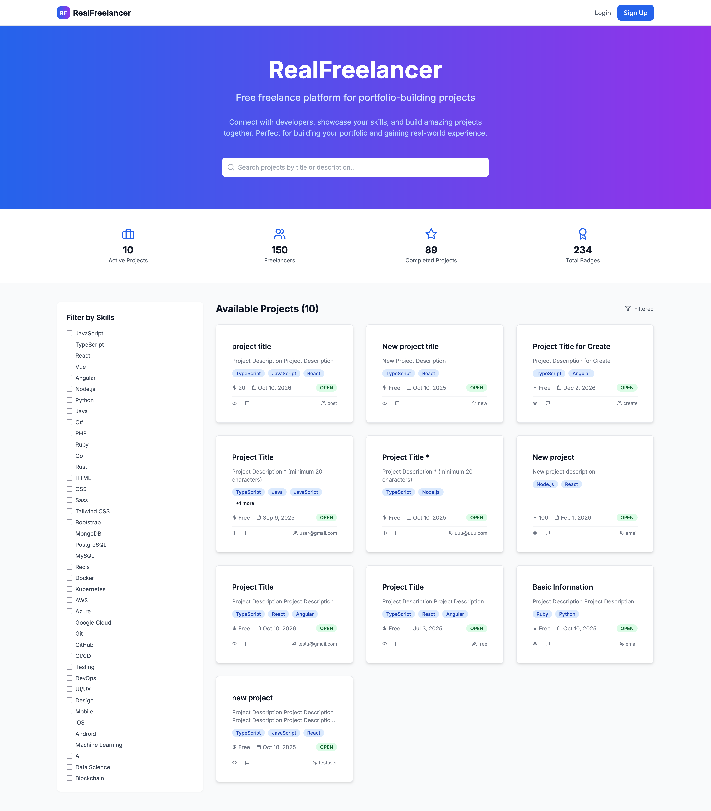

# 🎯 RealFreelancer - Portfolio Showcase

## 📋 Project Overview

**RealFreelancer** is a full-stack freelance platform built to demonstrate advanced web development, clean architecture, and modern DevOps. It’s perfect for your portfolio, learning, or as a launchpad for your own SaaS ideas.

---

## 🌟 Why This Project?

- **Real-world complexity**: Not a todo app! RealFreelancer covers authentication, dashboards, chat, file uploads, analytics, and more.
- **Modern stack**: Java 17, Spring Boot 3, Next.js 14, React 18, TypeScript, Docker, PostgreSQL.
- **Open-source spirit**: 100% MIT, ready for forks, stars, and your custom features.
- **Portfolio-ready**: Show recruiters you can build, ship, and document a real product.

---

## 🛠️ How to Use for Your Own Portfolio

> 1. Fork this repo and star it 🌟
> 2. Deploy locally or on your own server (see README)
> 3. Customize the branding, features, or add your own twist
> 4. Add your GitHub link to your profile in-app
> 5. Share your live demo or code in job applications!

---

## 🏆 Key Achievements

- **Full-Stack**: Spring Boot 3.2.0 (Java 17), Next.js 14 (React 18, TypeScript)
- **Database**: PostgreSQL (prod), H2 (dev)
- **Authentication**: JWT-based, secure
- **DevOps**: Docker, Docker Compose, GitHub Actions
- **UI/UX**: Tailwind CSS, Framer Motion, responsive design
- **Testing**: Structure for backend/frontend tests

---

## ✨ Technical Highlights

- **Clean Architecture**: Separation of concerns, modular code
- **Security**: JWT, input validation, CORS, XSS/SQLi protection
- **Modern UI**: Responsive, animated, and beautiful
- **Real-Time Chat**: WebSocket-powered (beta)
- **Analytics**: User dashboards, project stats
- **File Uploads**: Attachments for projects/messages
- **Moderation**: Reporting and admin tools

---

## 📊 Code Quality Metrics

- **SOLID Principles**
- **Type Safety** (TypeScript)
- **Comprehensive Comments**
- **Error Handling**
- **Unit & Integration Test Structure**

---

## 🚀 Deployment & Scalability

- **Dockerized**: Easy local or cloud deployment
- **Environment Config**: .env for secrets
- **Database Migration**: Ready for schema changes
- **CI/CD**: GitHub Actions

---

## 📈 Business Value

- **Freelance Platform**: Connects devs with projects
- **Portfolio Building**: Showcases your skills
- **Skill Matching**: Advanced filtering
- **Community**: Open-source collaboration

---

## 🔮 Future Enhancements

- Real-time chat improvements
- Advanced analytics
- Mobile app (React Native)
- AI-powered matching
- More moderation tools

---

## 📸 Screenshots

---

## 📞 Contact & Links

- **GitHub**: [MedAmestak/realfreelancer](https://github.com/MedAmestak/realfreelancer)
- **Live Demo**: [Coming Soon]
- **Docs**: [docs/README.md](./docs/README.md)

---

**Built with ❤️ and modern web technologies. Fork, star, and make it your own!** 