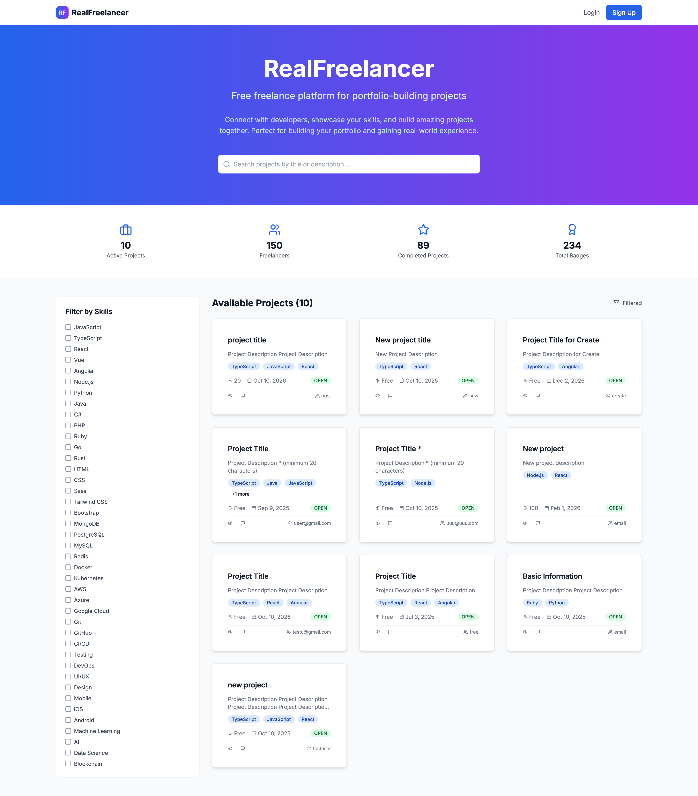

# 🚀 RealFreelancer - The Ultimate Open-Source Freelance Platform

[](https://openjdk.java.net/)
[](https://spring.io/projects/spring-boot)
[](https://nextjs.org/)
[](https://reactjs.org/)
[](https://www.typescriptlang.org/)
[](https://www.docker.com/)
[](LICENSE)
[](../../issues)

<div align="center">
  <h2>🌟 Build, Learn, and Launch Your Portfolio with RealFreelancer! 🌟</h2>
  <b>The modern, open-source freelance platform for developers, by developers.</b><br/>
  <i>Clone, fork, and make it your own. Perfect for learning, portfolios, and real-world projects.</i>
  <br/><br/>
  <b>⭐️ Star us if you love open source! Fork to start your own journey! ⭐️</b>
  <br/><br/>
  
</div>

---

## ✨ Key Features

- 🔐 <b>Secure Authentication</b>: JWT-based, password encryption, secure session management
- 📋 <b>Project Management</b>: Post, browse, and apply for projects with skills, budgets, and deadlines
- 🔍 <b>Advanced Search & Filtering</b>: Find projects by skills, budget, and more
- 💬 <b>Real-Time Chat</b>: WebSocket-powered chat for seamless communication (beta)
- 🏆 <b>Reputation & Badges</b>: Reviews, ratings, and badges for achievements (coming soon)
- 📂 <b>File Uploads</b>: Attach files to projects and messages
- 🔒 <b>Moderation System</b>: Report and moderate content
- 📊 <b>User Dashboards</b>: Analytics on projects, applications, and earnings
- 🎨 <b>Modern UI/UX</b>: Responsive, beautiful interface with Tailwind CSS & Framer Motion

> **Note:** Some features (badges, advanced analytics) are in active development. See [issues](../../issues) for roadmap.

---

## 🖼️ Screenshots

<!-- Add more screenshots or GIFs here -->


---

## 💡 Why Star or Fork RealFreelancer?

- 🚀 <b>Perfect for Portfolio</b>: Show off real-world, full-stack skills
- 🧑‍💻 <b>Learn Modern Tech</b>: Java 17, Spring Boot 3, Next.js 14, React 18, TypeScript, Docker
- 🌍 <b>Open Source</b>: 100% MIT, ready for your customizations
- 🏗️ <b>Production-Ready Patterns</b>: Clean architecture, security, CI/CD
- 🤝 <b>Community-Driven</b>: Join, contribute, and grow with us!

---

## 🛠️ Tech Stack

| Category      | Technology |
| :------------ | :--------------------------------------------------------------------------------------------------------------------------------------------------------------------- |
| **Backend**   | **Java 17**, **Spring Boot 3**, Spring Security, Spring Data JPA, JWT |
| **Frontend**  | **Next.js 14**, **React 18**, **TypeScript**, Tailwind CSS, Framer Motion |
| **Database**  | **PostgreSQL** (Production), **H2** (Development) |
| **DevOps**    | **Docker**, **Docker Compose**, GitHub Actions (CI/CD) |
| **Build Tools** | **Maven** (Backend), **npm** (Frontend) |

---

## 🚀 Getting Started

> **Quick Start:** See [QUICK_START.md](./QUICK_START.md) for a 3-minute setup!

### Prerequisites
- [Docker](https://www.docker.com/get-started) & [Docker Compose](https://docs.docker.com/compose/install/)
- [Git](https://git-scm.com/)

### 1. Clone the Repository
```bash
git clone https://github.com/MedAmestak/realfreelancer.git
cd realfreelancer
```

### 2. Configure Your Environment
- Copy `.env.example` to `.env` and set your secrets:
  ```bash
  cp .env.example .env
  # Edit .env for your setup
  ```
- Generate a strong JWT secret:
  ```bash
  openssl rand -hex 32
  ```

### 3. Run the Application
```bash
docker-compose up --build -d
```
- **Frontend**: [http://localhost:3000](http://localhost:3000)
- **Backend API**: [http://localhost:8080](http://localhost:8080)

### 4. Stopping the Application
```bash
docker-compose down
```

---

## 💾 Persistent Database

- Uses **PostgreSQL** in Docker for persistent data
- Data stored in Docker volume (`postgres-data`)
- Connect with DBeaver, TablePlus, or pgAdmin:
  - Host: `localhost`, Port: `5432`, DB: `realfreelancer`, User: `user`, Password: `password`

---

## 📁 Project Structure

```
realfreelancer/
├── backend/            # Spring Boot API
│   ├── src/main/java/com/realfreelancer/
│   │   ├── config/     # Security & App Configuration
│   │   ├── controller/ # REST API Endpoints
│   │   ├── dto/        # Data Transfer Objects
│   │   ├── model/      # JPA Entities
│   │   ├── repository/ # Data Access Layer
│   │   └── service/    # Business Logic
│   ├── pom.xml         # Maven Dependencies
│   └── Dockerfile      # Backend Container
├── frontend/           # Next.js React App
│   ├── app/            # Next.js 14 App Directory & Pages
│   ├── components/     # Reusable React Components
│   ├── contexts/       # Global State Management (e.g., Auth)
│   ├── hooks/          # Custom React Hooks
│   ├── types/          # TypeScript Type Definitions
│   └── Dockerfile      # Frontend Container
├── .github/workflows/  # CI/CD Workflows
├── docker-compose.yml  # Docker Orchestration
└── README.md           # This file
```

---

## 🤝 Community & Contributing

- Fork, star, and submit pull requests!
- Open issues for bugs, features, or questions
- See [CONTRIBUTING.md](./CONTRIBUTING.md) (coming soon)

---

## 📝 License

MIT License. See [LICENSE](LICENSE).

---

## 📞 Contact & Links

- Author: Mohamed Amestak ([GitHub @MedAmestak](https://github.com/MedAmestak))
- [Documentation](./docs/README.md)
- [Quick Start](./QUICK_START.md)
- [Portfolio Showcase](./PORTFOLIO_SHOWCASE.md)

---

<p align="center">
  ⭐️ <b>Star this repository if you find it helpful!</b> ⭐️<br/>
  <i>Let’s build the future of freelance, together.</i>
</p>